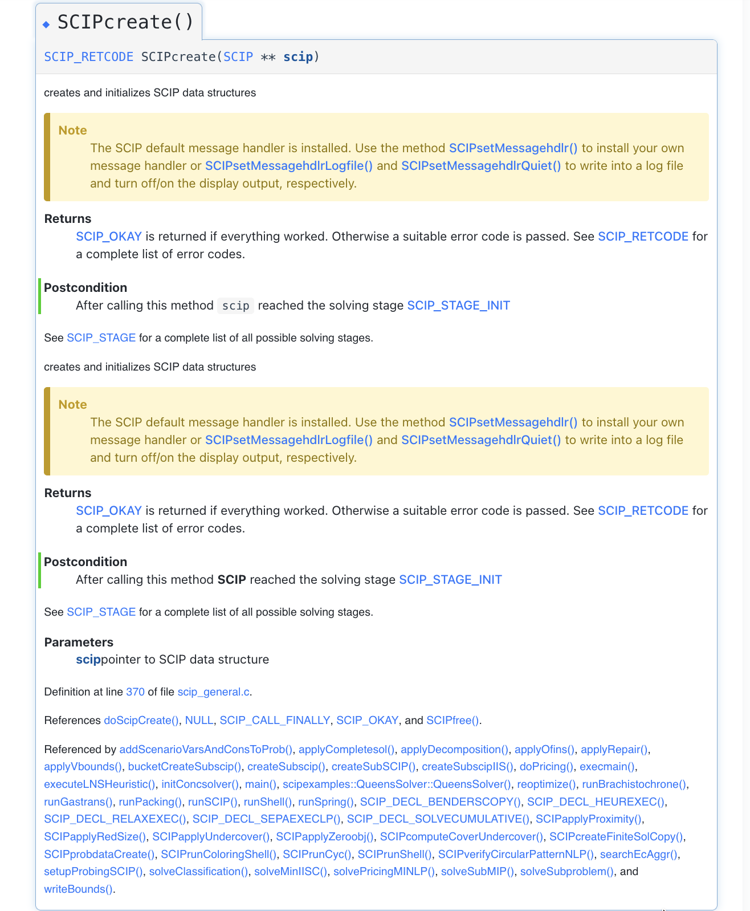
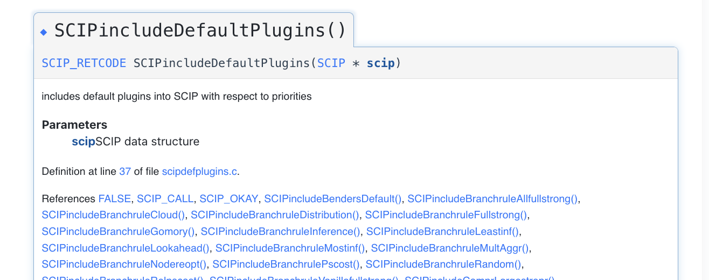
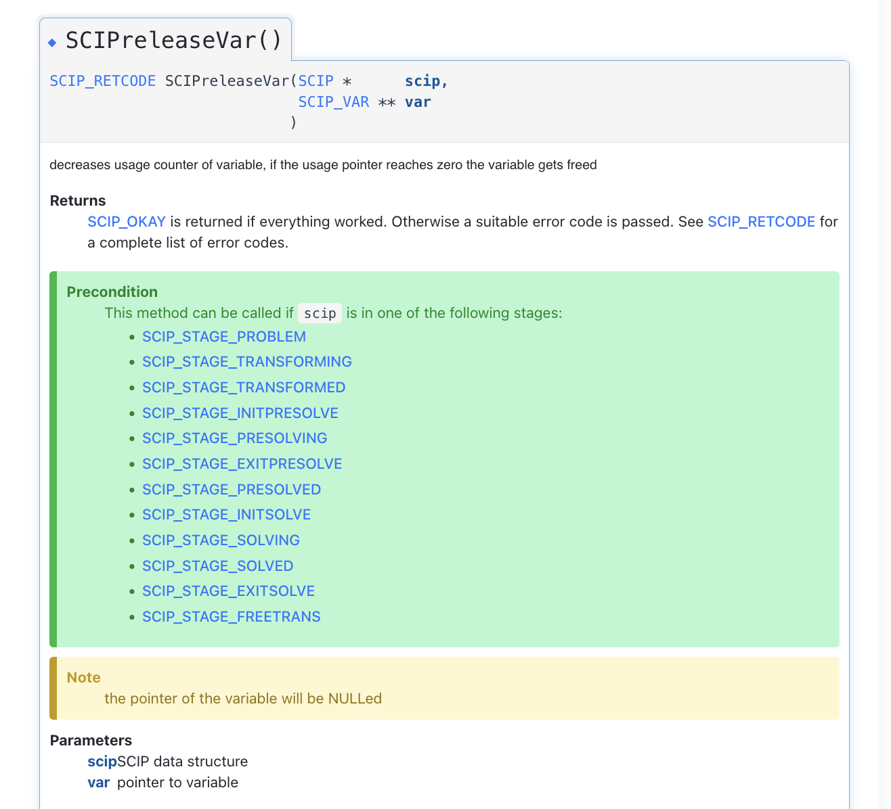
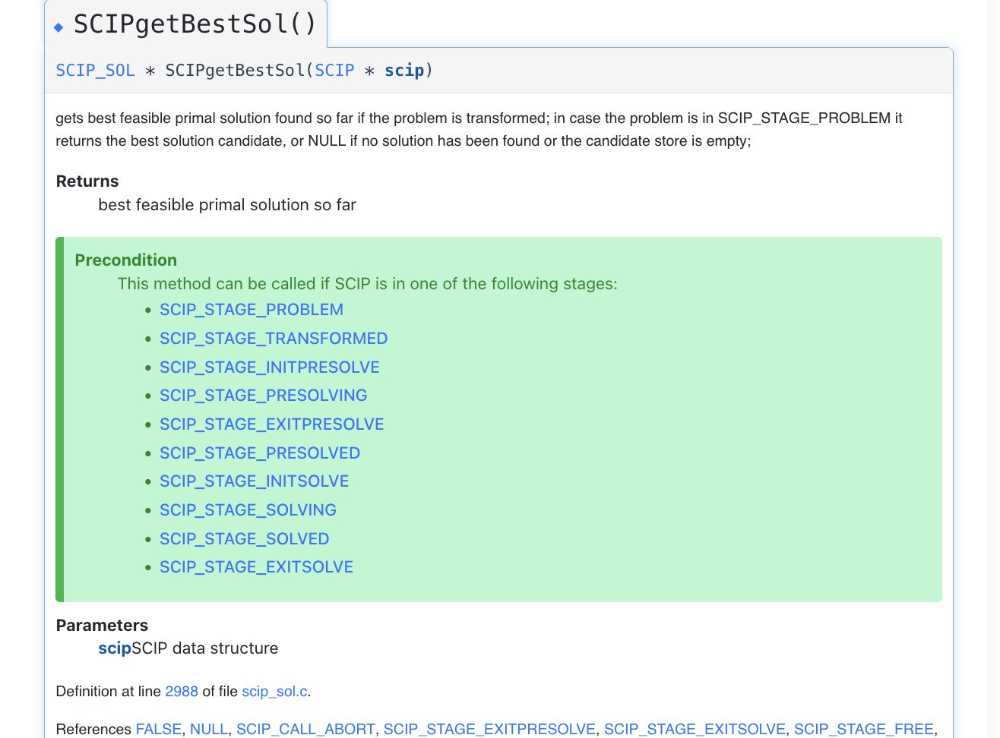
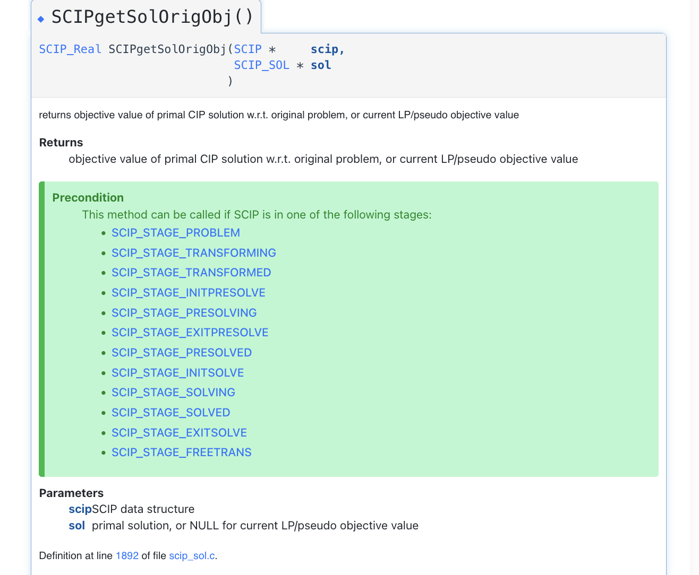

# Day 1 Review

## std::span

A span is a non-owning view of an array like object

```cpp
#include <vector>
#include <iostream>
#include <span>

void fill_to_n(std::span<int> in, int n){
    for (int i=0; i< n; ++i){
        in[i] = i+1;
    }
}

int main(){
    int arr1[] = {1,1,1,1,1,1,1,1,1,1};
    std::vector<int> arr2 = {1,1,1,1,1,1,1,1,1,1};
    fill_to_n(arr1);
    fill_to_n(arr2);

    for (int i=0; i< 10; ++i){
        std::cout <<  arr1[i] << " " ;
    }
    std::cout << std::endl; // prints 1 - 10
    for (int i=0; i< 10; ++i){
        std::cout <<  arr2[i] << " " ;
    }
    std::cout << std::endl; // prints 1 - 10
}
```

## RAII (Resource Acquisition Is Initialization) without state

We encounter this pattern when creating a SCIP object

```cpp
#include <memory>
#include "utils.hpp" // Defines CALL_CHECK
struct SCIPDeleter{
    void operator()(SCIP* scip) const{
        SCIPfree(&scip);
    }
};
using SCIPPtr = std::unique_ptr<SCIP, SCIPDeleter>;

int main(){
    SCIPptr scip; 
    CALL_CHECK(SCIPcreate(std::out_ptr(scip)));
    CALL_CHECK(SCIPincludeDefaultPlugins(scip.get()));
}
```

We look at SCIP documentation.



`SCIP` type is marked with `**` meaning a pointer is expected where in the address pointed to by the pointer 
the adress of the created `SCIP` object will written.



A `SCIP*` is expected. Contrary to the former case, we only need to recall where the `SCIP` object is created,
so we pass the adress to a `SCIP` object.


## RAII (Resource Acquisition Is Initialization) with state
We encounter when creating SCIP variables and SCIP constraints.

```cpp
#include <memory>
#include "utils.hpp"

struct VarDeleter{
    SCIP* scip;
    VarDeleter(SCIP* scip): scip(scip){}
    void operator()(SCIP_VAR* var) const{
        SCIPreleaseVar(scip, &var);
    }
};
using VarPtr = std::unique_ptr<SCIP_VAR, VarDeleter>;

int main(){
    // Setup SCIP and so on 
    // ...
     
    VarDeleter varDeleter(scip.get());
    VarPtr var(nullptr, varDeleter);
    CALL_CHECK(SCIPcreateVarBasic(scip.get(), std::out_ptr(var), std::format("x{}", i).c_str(), lb[i], ub[i], obj[i], vartype[i]));
    CALL_CHECK(SCIPaddVar(scip.get(), var.get()));
}
```

Contrary to the previous example the 'deleter' this time requires the SCIP object.

From the SCIP documentation:



## std::unique_ptr should be 'moved' into a vector

We see this variable when we generate multiple variable

```cpp
std::vector<VarPtr> vars;
for (int i =0; i< 4; ++i){
    VarPtr var(nullptr, varDeleter);
    // Setup var like the above
    vars.push_back(std::move(var));
}
```

This is because there can exist at most a copy of a unique_ptr at once. If we don't move it then,
there is temporarily atleast 2 copy (1 in the vector and another the temporary variable inside the loop).

## Use auto when SCIP returns part of its memory

Sometimes SCIP returns part of its memory this is marked (among other ways) by SCIP returning a pointer
to a function call (marked by `*`). 
We encounter this today during `SCIPgetBestSol`.

```cpp
if (SCIPgetStatus(scip.get()) == SCIP_STATUS_OPTIMAL) {
    auto sol = SCIPgetBestSol(scip.get());
}
```

In this case, we take the type of sol as auto. From the SCIP Documentation we can see that the return type here is a `SCIP_SOL *`.



It is also okay to do 

```cpp
SCIP_SOL * sol = SCIPgetBestSol(scip.get()); 
```

We then use it without `.get()` e.g.

```cpp
SCIPgetSolOrigObj(scip.get(), sol)
```

Notice here that sol is of type `SCIP_SOL *` so it already match the type in the documentation.



